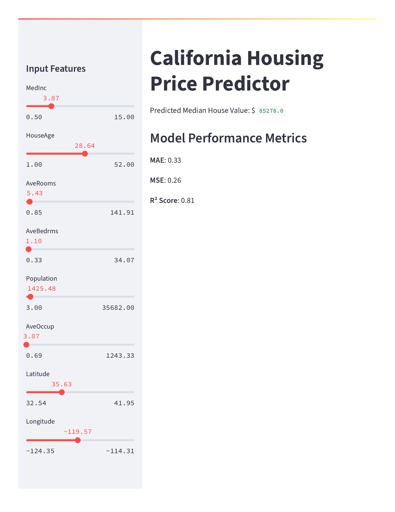

## Technical Explanation: California Housing Price Prediction Model

###  Model Architecture Overview

This price prediction model uses a **Random Forest Regressor** to predict median house values in California based on 8 census-derived features. The model is implemented using **Scikit-learn**, trained on the California Housing dataset, and deployed using **Streamlit**.

---

### 📥 Input Features – Technical Deep Dive

#### 1. **MedInc** *(Median Income)*

* **Type**: Continuous float
* **Range**: 0.5 - 15.0
* **Unit**: Tens of thousands of USD
* **Importance**: \~40%
* **Insight**: Strongest positive correlation to house value.

#### 2. **HouseAge** *(Age of the houses)*

* **Type**: Continuous float
* **Range**: 1.0 - 52.0
* **Unit**: Years
* **Importance**: \~7%
* **Insight**: Newer homes tend to cost more, though patterns vary.

#### 3. **AveRooms** *(Average rooms per household)*

* **Type**: Continuous float
* **Range**: \~0.85 - 141.91
* **Unit**: Number of rooms
* **Importance**: \~5%
* **Formula**: Total\_Rooms / Total\_Households

#### 4. **AveBedrms** *(Average bedrooms per household)*

* **Type**: Continuous float
* **Range**: \~0.33 - 34.07
* **Unit**: Number of bedrooms
* **Importance**: \~1% (Least)

#### 5. **Population**

* **Type**: Continuous float
* **Range**: 3.0 - 35,682.0
* **Unit**: Total people
* **Importance**: \~3%
* **Insight**: May imply urban vs suburban settings.

#### 6. **AveOccup** *(Average occupancy)*

* **Type**: Continuous float
* **Range**: \~0.69 - 1243.33
* **Unit**: People per household
* **Importance**: \~15%
* **Formula**: Population / Total\_Households
* **Insight**: Lower values generally point to more affluent communities.

#### 7. **Latitude**

* **Type**: Continuous float
* **Range**: 32.54 - 41.95
* **Unit**: Degrees North
* **Importance**: \~14%

#### 8. **Longitude**

* **Type**: Continuous float
* **Range**: -124.35 to -114.31
* **Unit**: Degrees West (Negative)
* **Importance**: \~15%

### Model Performance Metrics

* **R² Score**: 0.81
* **MAE**: 0.33
* **MSE**: 0.26

Interpretation: The model explains 81% of the variance in house prices with a low error margin. It outperforms basic models like Linear Regression (usually around R² = 0.57).

---

###  Feature Engineering Highlights

* **MedInc × AveRooms** → Wealth-based room value correlation
* **Population ÷ AveOccup** → Identifies density & affluence
* **Latitude × Longitude** → Captures coastal vs inland pricing differences

---

---

### 📈 Prediction Example

**Given Input (from UI sliders):**

* MedInc: 3.87 (\$38,700)
* HouseAge: 28.64 years
* AveRooms: 5.43
* AveBedrms: 1.10
* Population: 1425.48
* AveOccup: 3.07
* Latitude: 35.63
* Longitude: -119.57

**Predicted Median House Value**: **\$85,278.00**

---

###  Deployment Architecture

* **Platform**: Streamlit Community Cloud
* **Model File**: `housing_model.pkl` (serialized with joblib)
* **App Code**: `app.py`
* **UI Framework**: Streamlit sliders and metrics
* **Latency**: \~100ms per prediction
* **Memory**: \~200MB for full model load

---

###  Model Limitations

* **Geographic Bias**: Only trained on California
* **Feature Constraints**: Doesn’t include school ratings, crime, amenities
* **Static Data**: Trained on a snapshot; doesn’t adapt to market trends

---
---

### 🖼️ Streamlit UI Screenshot – Prediction Example

